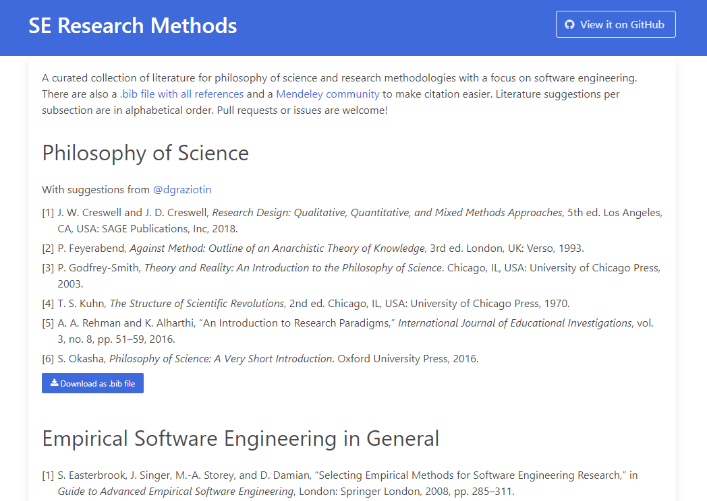

# Research Methodologies in Software Engineering

> A curated collection of literature for philosophy of science and research methodologies with a focus on software engineering that is hosted via GitHub Pages: https://xjreb.github.io/swe-research-methods

There is also a `.bib` file with all references (see [here](public/bibs/all-refs.bib)) to make citation easier.
Literature suggestions per subsection are in alphabetical order.
The website relies on the IEEE reference format.
Pull requests or issues are welcome!

